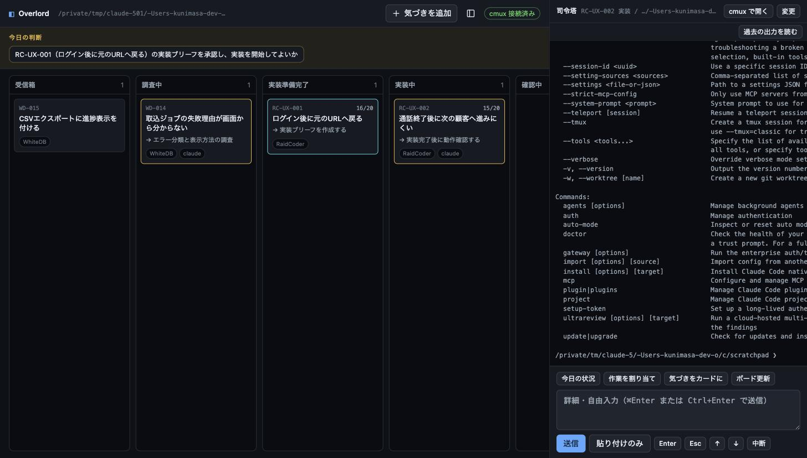
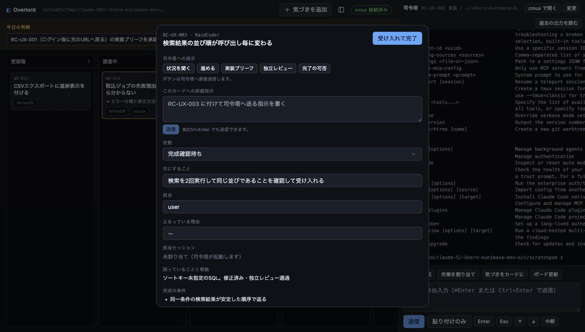

# Overlord

[日本語](README.md) | [English](README.en.md)

A toolkit for running product development with AI across multiple projects: find problems, decide on fixes, implement them, and verify the results.

You decide what to work on first, whether a fix is right, and whether the work is done. The AI handles triaging observations, investigating code, scoping the work, implementing, reviewing, and keeping progress up to date.



## Architecture

```text
observation -> work card -> prioritize -> implementation brief -> implement -> independent review -> acceptance
                    |                                                              |
                    +----------------- docs/product-ops/board.yaml ---------------+
                                              |
                                              +-> Overlord Console (browser)
                                                          |
                                                          +-> commander (cmux) -> subagents per card
```

| Piece | Role |
| --- | --- |
| Five skills | The AI's operating procedures (below) |
| `docs/product-ops/board.yaml` | The single machine-readable source of truth |
| Overlord Console | A browser dashboard that renders and edits the board file |
| Commander | The one cmux session you talk to; it dispatches each card's work to subagents |

### Cards, changes, and tasks

The board has three levels, and **you only manage the top one**.

| Level | Meaning | Where you see it |
| --- | --- | --- |
| **Card** | One product outcome; the human decision unit | A card on the kanban |
| **Change** | One delivery unit: 1 change = 1 worktree = 1 branch = 1 PR = 1 agent execution unit | Read-only inside the card modal |
| **Task** | A step inside an agent's run | Never shown |

A change moves one pull request at a time: `start` creates its worktree and branch, `pr` pushes it and opens the pull request, `reviewed` records the commit the independent review read, and `sync` writes the pull request state back after the merge. `scripts/change.sh` runs each step and records it on the board, so nobody edits the board by hand. A change whose reviewed commit is not the pull request head does not go to acceptance.

Large work is split into **changes**. Many files, a backend/frontend divide, a migration, a desire for smaller pull requests — all of these become changes, and **the card count stays the same**.

A new card is created only when the piece is a separate product outcome: something you could prioritize, ship, or cancel on its own, with its own acceptance conditions.

## Included skills

| Skill | Purpose |
| --- | --- |
| `product-ops` | Prioritize work and keep the AI's status organized |
| `product-improvement-card` | Turn rough observations into actionable work cards |
| `product-ux-audit` | Walk real user flows and find friction |
| `product-implementation-brief` | Scope a change tightly before any code is written |
| `product-change-review` | Have a different AI verify the change against its goal |

## Overlord Console

A local dashboard built with React + shadcn/ui. Changes to `board.yaml` appear on screen automatically.

### Board

- An eight-column kanban (inbox / discovery / specified / implementing / reviewing / acceptance / done / blocked) with drag & drop
- **Cyan border** = a card that needs you (awaiting acceptance, owned by you, or listed in today's decisions)
- **Yellow border** = a card the AI is actively working on
- The "decisions today" bar shows at most three things only you can decide
- Done cards can be deleted from the right-click menu

### Card modal



Clicking a card opens a centered modal.

- **Instruction buttons** (ask status / advance / implementation brief / independent review / ready to close?) send to the commander with a single press; skill command strings never appear on screen
- **Detailed instruction**: free-form text is sent to the commander prefixed with the card ID
- **Accept & complete**: shown on cards awaiting acceptance; one click marks them done
- State, next action, owner, and blocker are editable in place (Escape cancels)

### Commander sidebar

The right-hand sidebar is the commander — the one cmux session you talk to.

- Toggle with the top-bar icon or **⌘B**; the state is persisted
- The terminal mirror updates almost immediately on commander activity (event-driven with a 10-second safety net, reading over a direct Unix socket — no child processes)
- "Read past output" loads up to 2,000 lines of scrollback; updates pause while you read, and "resume following" returns to live tailing
- Template buttons (today's status / assign work / capture an observation / update the board), a free-form composer, and key controls (Enter / Esc / ↑ / ↓ / interrupt)
- The sidebar never opens by itself; opening and closing is always your action

## Installation

### Skills (Claude Code)

```bash
git clone <YOUR_REPOSITORY_URL>
cd overlord
./scripts/install.sh claude      # personal (~/.claude/skills)
# per-project: run /path/to/overlord/scripts/install.sh project inside the target repo
```

For Codex use `./scripts/install.sh codex`. The installer refuses to overwrite existing skills with the same name.

### Console

Requires [Bun](https://bun.sh). A prebuilt frontend is included, so it runs as is.

```bash
brew install oven-sh/bun/bun     # if not installed yet
/path/to/overlord/scripts/console.sh ~/dev/your-project
```

Opens at `http://127.0.0.1:7377`. Use `--port 7400` to change the port, `--open` to open it in a cmux browser pane.

After changing the frontend, regenerate `console/public` with `cd console && bun install && bun run build`.

The server listens on `127.0.0.1` only and rejects requests whose `Host` / `Origin` is not loopback.

## Getting started

Start Claude Code at the root of the target repository and run:

```text
/product-ops
Start managing this project's work.
Review the code, existing docs, and project conventions,
then create docs/product-ops/board.yaml.
Give me at most three decisions to make first.
```

Start the console in another terminal and register that Claude Code session as the commander from the sidebar's "change" button (or let the session register itself via `cmux identify --json`).

## Daily use

1. **Capture observations**: "Add an observation" in the top bar, or "capture an observation" in the sidebar
2. **Advance**: open a card and press "advance" once; the commander runs the state-appropriate step (card → brief → implement → independent review) with subagents
3. **Decide**: you only need to look at "decisions today" and cyan-bordered cards; approving briefs and accepting work happens with the card's buttons
4. **Accept**: check cards awaiting acceptance and press "accept & complete"; clear finished cards via right-click

## Operating rules

- At most three cards in implementation at once; around ten active items total (the top bar warns when exceeded)
- One `board.yaml` per repository; run one console per repo (on different ports) for multi-repo work
- The console is your view; the AI always works from `board.yaml`. Writes are protected by optimistic locking, so the AI's updates are never silently overwritten
- Independent review is done by a different subagent from the one that implemented, so no AI reviews its own change
